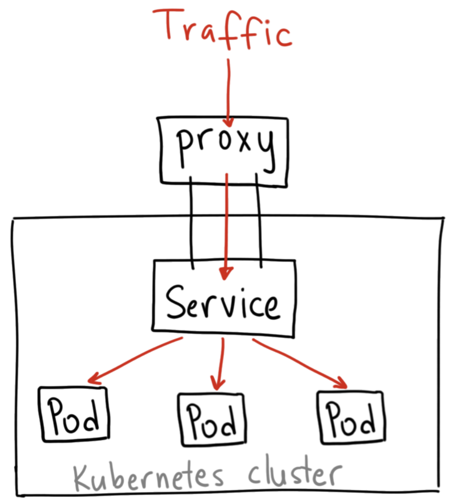

## Kubernetes - Service

### Some Questions

What is a service and why do we need it in kubernetes?

Kubernetes deployments and pods are within a seperate network. 
                        

                       +----------------+ host 192.168.0.0
                       |   HOST Network |
                       +----------------+
                               |
                       +----------------+
                       |  kubernetes    |
                       |    cluster     |
                       +----------------+
                               |
                       +-------|--------+ [10.0.0.0/16]
                       | Pod Network   |
                       +-------|--------+
                               |
                       +----------------+       
                       |     Node 1     |
                       | +------------+ |
                       | |    Pod A   | |
                       | +------------+ |
                       +----------------+ 

Kubernetes network helps to provide isolation and removes port conflicts between host and pod network.

Communication between pods, or external network is possible through service, loadbalancer or ingress controller. One among them is **service**.